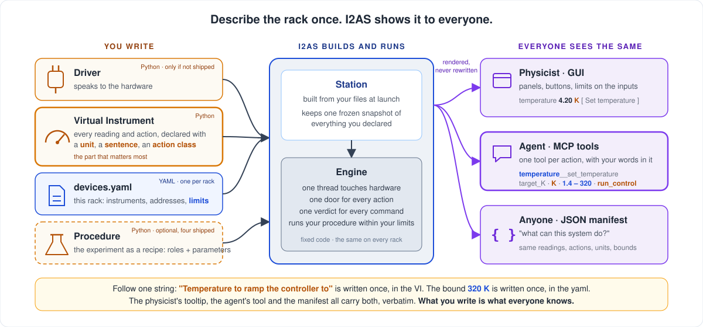

# I2AS — Instrument to Agentic Station

A framework that turns a rack of laboratory instruments into a measurement station that a physicist, a script, and an AI agent can operate together, through one engine, under one set of rules, with one record of who did what.

## Why this exists

In most labs a setup is a collection of instruments bought from different vendors: a temperature controller from one, a magnet power supply from another, a source-meter and a nanovoltmeter from a third, a camera and a stage from a fourth. Each comes with its own protocol and its own quirks, and they get wired together in ad hoc scripts that grow with every experiment. Those scripts work for the person who wrote them, until the day a ramp is left running, a limit is typed with the wrong exponent, or a new student has to figure out what a column in last year's data file meant.

I2AS is a harness for that situation. It connects the instruments, lets you write experiments as procedures, and provides the parts every station needs but nobody wants to write twice: safety limits enforced on every action, constant monitoring of every reading, orchestration of a run from start to finish, and metadata saved with the data. It then surfaces the whole station to four clients at once: a desktop GUI, an MCP server for AI agents, an in-process Python gateway, and a command-line client.

The central idea is that you describe each instrument once, at the Virtual Instrument layer, and that description is propagated everywhere. Every reading is declared with a unit and a sentence; every action with typed parameters, a bound, and how much authority it needs. The GUI panels, the agent's tool schemas, the capability manifest, and the CLI are all rendered from those declarations, never written by hand. Once a lab has drivers for its instruments, the physicist writes the Virtual Instruments and a short YAML file for the rack, and the result is a fully functioning station. Virtual Instruments are small, declarative, and follow a template shipped in this repository, so they can be drafted with a coding agent and verified by the conformance suite before they touch hardware.



What the framework provides, so a setup does not have to:

- **Safety.** Every action, from any client, is a command checked against the setup's limits, the session envelope, attendance, a kill switch, and run ownership before it reaches hardware. Emergency standby is never refused to anyone.
- **Constant monitoring.** One tick loop polls every instrument, tracks ramps, detects stalls, records trends, and degrades to a safe state on an unhandled error rather than vanishing with the magnet ramping.
- **Procedure orchestration.** Runs are validated when they are queued, started by the engine, paused and resumed at safe boundaries, and answered with a verdict at every step.
- **Metadata and records.** One HDF5 file per run with the sample, the parameters, and the instrument declarations; an append-only log of every agent action; an analysis stage that turns a finished run into a notebook entry.
- **Four surfaces from one declaration.** GUI, MCP, Python, and CLI all see the same instruments, actions, units, and bounds, and are seen doing the same things.

## Architecture: independent layers

I2AS is built as six layers, and each layer is blind to the ones above it. Drivers know nothing about Virtual Instruments. Virtual Instruments never import a driver; the Station injects one at build time. Procedures never import a driver or a Virtual Instrument; they name the roles they need and receive whatever the rack has. The GUI never imports a driver. The engine never imports the session layer. These are not conventions. Eighteen import contracts are checked in CI, and a change that violates one fails the build.

The independence buys three things. A vendor driver can be swapped without touching a procedure. Every driver has a simulated twin, so the entire stack above it runs and is tested without a cryostat in the room. And each layer can be reasoned about, and tested, on its own.


Read the middle column bottom-up for **information**, top-down for **actions**.

### Information flows up

1. **Instruments and drivers (L0)** answer SCPI or serial queries. A driver is a plain Python class that knows nothing about the layers above it.
2. **Virtual Instruments (L1)** wrap a driver in physics vocabulary. A method marked `@monitored` is a reading with a unit and a description. A method marked `@control` is an action with typed parameters, configured limits, and an action class that says how much authority it needs.
3. **The Station (L2)** holds every Virtual Instrument, polls each one every tick, and builds `StationInfo`, the frozen snapshot of what the station can read, what it can be asked to do, and within which bounds.
4. **The Orchestrator (L3)** is the single writer. It runs one cooperative tick on one instrument thread, drives procedures (L4), and writes every run to one HDF5 file through the data manager (L5). Each tick it broadcasts a status snapshot; each state change is an event.
5. **The control contract** carries those messages across the thread bridge as frozen, JSON-safe dataclasses. Clients keep a status mirror and answer every read from it. A read never blocks and never polls the engine.
6. **The session layer (L6)** is where the two clients live: the GUI, a proxy plus a mirror acting as the human operator, and the agent gateway, one connection with one role and one actor identity.
7. **Agents and people** see the same system through different transports: the GUI in-process, an LLM agent through the MCP adapter and the local-socket gateway server, a script through the request spool, which is a JSON file dropped into a directory and drained by the engine's own tick.

### Actions flow down, and answers come back

Every action from every client, whether a button click, an MCP tool call, or a spooled file, becomes one `Command` that names its actor (kind, id, role) and enters the engine through one door, `submit()`. The engine checks the kill switch, attendance, run ownership, and the session envelope, then answers with exactly one `Verdict` on the one stream every client sees. The physicist's window therefore shows the agent being obeyed or refused exactly as it shows itself.

What comes back is more than the verdict. The agent's commands and their answers are appended to `agent_actions.jsonl` inside the experiment folder. Each finished run is an HDF5 file the analysis worker reads in its own process. An analysis report becomes a notebook entry, queued in an outbox and published only when the setup opts in. Copy the experiment folder and you copy the evidence.

### Reflection: every surface shows what the others did

A human can only attend, and only pull the kill switch, if the window in front of them shows what the station was asked to do, whoever asked. So no surface keeps a private truth about the station's configuration. Three rules make that hold, and they are the **reflection standard**:

- **The answer echoes the question.** A `Verdict` carries the `args` of the `Command` it answers, so the one message every client already receives says who asked for what and what the engine said. An accepted `set_field` from an agent is written into the same input field on the instrument card the physicist would have typed it into; a refused one is not, and appears in the Agents panel with its arguments and the rule that refused it.
- **A run start carries the run.** `RunStarted` names the procedure class, the run owner and the run's effective parameters. The procedure window puts them into its form, selects the procedure, and says above the form whose run it is showing; the status mirror keeps the manifest so a window opened mid-run shows the run and not a stale draft; the Monitor window's header names the procedure and lists its parameters in the tooltip.
- **The operator goes through the same door.** The window's own Run Now submits the JSON `run_procedure` command an agent submits over MCP or the CLI sends, answered by the same verdict and reflected by the same `RunStarted`. The form's `apply_values()` is the inverse of its `collect_values()`, driven by the procedure's declared form alone, so a procedure that can be rendered can be reflected with no code of its own. That includes the sweep: a `SweepAxis` is declared as guarded blocks of the Sweep group, a mode selector and the linear, segments, or CSV block it picks, and the segments are a `ParamSpec(type=list, columns=...)`, a table of typed rows that renders as a generic table editor and reaches an agent's `describe_procedure` with its columns. No parameter of a run is owned by a hand-written widget.

The status snapshot stays the minimal per-tick payload it is: parameters travel on the edge that changes them, once, not on every tick.

The same holds in the other direction. `read_readings` (the `i2as://readings` resource) answers an agent with the last per-tick `Readings` event, the very numbers the instrument cards and front panels display, so an agent and the physicist read one value off one message rather than each polling the instrument.

### Single source of actions

No action is written twice. Two declarations drive every surface:

- the `CommandName` enumeration, whose values are the Orchestrator's own method names;
- the `@monitored` and `@control` declarations on each Virtual Instrument, with their parameters, units, limits, and action class.

GUI panels, the capability manifest, and the MCP tool schemas are all rendered from those declarations. Conformance tests diff the three surfaces, so neither client can offer an action the other cannot see. A tool's description is the docstring a person reads in the code, so the text an agent sees is never a hand-maintained copy that drifts.

### Gradual exposure

An agent declares a role, and one permission table says which action classes that role may take. Each role is a column of that table; nothing is decided by a branch in code.

| Role | read | recovery | run_control | envelope | analysis |
|---|---|---|---|---|---|
| `observer` (default) | yes | no | no | no | no |
| `analyst` | yes | no | no | no | yes |
| `debug` | yes | unattended only | no | no | no |
| `session` | yes | yes | yes | no | yes |
| operator (human) | yes | yes | yes | yes | yes |

`analysis` covers writing and running analysis recipes and scripts over finished runs in the analysis worker, and parking their results for a human to approve. The `analyst` role gets that and nothing that touches the station, so an agent, whether embedded or connected over MCP, can be trusted to analyse without being trusted to measure. See [docs/analysis-agent.md](docs/analysis-agent.md) for the agent's analysis loop, the analysis sandbox and the plan for the embedded analyst.

Three mechanisms can only ever subtract from that table. Each door has a ceiling (`gateway_max_role`, `spool_max_role`, both `observer` by default) that caps what a connection may claim. The kill switch, set by the human, narrows every agent to read-only or to nothing at all. And run ownership means an agent may abort only the run it started, unless it declares a takeover with a written reason.

One action is outside the table. Emergency standby is permitted to every role, in every state, at every kill-switch setting. Whoever can see a problem must be able to make the station safe.

### Where data lives: one session folder, one fixed tree

The operator makes exactly one choice about where data goes: the **session folder** (User → Session Folder…, any folder on disk; the Monitor header shows the session's name). Everything below it has one shape, so a person, a script or an analysis agent finds any run of any experiment without being told where to look:

```
<session folder>/                      the only folder the operator chooses
  session.json                         name, owner, experiment index
  001_<experiment label>/              experiments, numbered in the order started
    experiment.json  agent_actions.jsonl  outbox.jsonl
    data/
      run-0001_FieldSweep.h5           runs, numbered; the procedure; the
      run-0002_FieldSweep_10K.h5       operator's optional label last
    analysis/
      recipes/                         this experiment's analysis recipes
      run-0001/                        report.json, figures, scripts/<id>/
  002_<experiment label>/
```

A run needs an open experiment, and the engine places every run, whoever started it, in that experiment's `data/` folder as `run-NNNN`. Numbers are never reused. The machine remembers the active and recent session folders in `<measurement root>/sessions.json`.

## Setting up your own station

Most of I2AS is fixed machinery you never edit per rack. A new setup touches four things: a driver if yours is not shipped, a Virtual Instrument that declares what the instrument reads and does, one YAML file naming the rack's instruments and limits, and, when the shipped sweeps do not fit, a procedure describing the experiment. Everything the agent and the GUI see is rendered from those declarations.


Follow one string through the picture. The sentence "Temperature to ramp the controller to" is written once, on a `ParamSpec` in the Virtual Instrument. The bound of 320 K is written once, in the setup's YAML. The tool the agent receives carries both, verbatim, with the unit and the action class beside them. Nothing in between edits a word, so the quality of what the agent knows about your rack is exactly the quality of what you wrote in those two files.

- **Driver (L0).** A plain Python class over VISA or serial. It knows nothing about the layers above it. Every shipped driver has a simulated twin.
- **Virtual Instrument (L1).** Each reading is a `@monitored` method with a unit and a one-sentence description. Each action is a `@control` with typed parameters, a unit per parameter, and an action class. Limits that belong to the setup are named in `control_limits` and filled from YAML. A template lives in `.claude/skills/write-measurement-vi`, and the conformance suite refuses a Virtual Instrument that leaves any declaration blank.
- **Setup config.** `configs/<my_setup>/devices.yaml` lists the drivers with their addresses and the Virtual Instruments with their driver roles, `init_params` (the limits), and metadata. `monitor.yaml` sets the tick interval and the role ceilings for agents. Copy a shipped config such as `sim_cryostat` to start.
- **Procedure (L4), optional.** A `BaseProcedure` subclass in `i2as/procedures` is a recipe for one kind of experiment. It names the instrument roles it needs, never a configured instrument, so the same recipe runs on any rack that has such an instrument. It declares its parameters as `ParamSpec`s, scalars or a `list` of typed rows with declared `columns`, and returns plans from `initiate()` and `change_sweep_step()`; it never touches hardware. Four are shipped: field sweep, temperature sweep, field imaging, time series. Any named subclass dropped into that package is discovered at launch and appears in the GUI's run window and in the agent's `run_procedure` tool under its class name.

At launch, `build_station()` reads the config directory, imports the classes, injects each driver into its Virtual Instrument by role, and registers every Virtual Instrument under its YAML name. An instrument that fails to connect is registered offline rather than aborting the build. `i2as-doctor` checks the YAML before you launch.

## Quick start

```bash
python -m pip install -e .[dev]
i2as --config sim_cryostat        # desktop app on the simulated cryostat
make check                        # lint, layer contracts, tests
```

Connect an agent to the running app as an observer, then widen the role deliberately:

```bash
python -m i2as.mcp --role observer          # MCP server on stdio
i2as-ctl tools                              # list every tool the station publishes
i2as-ctl status                             # the engine's latest snapshot
```

The `.mcp.json` in this repository registers that MCP server for Claude Code with the observer role. Raising the ceiling is a decision made in the setup's `monitor.yaml` (`gateway_max_role`, `spool_max_role`), never by the agent.

### Remote access: the same tools at a URL

`python -m i2as.mcp` serves MCP on stdio, which means the client has to launch it, on this machine. A client on the web (ChatGPT, Open WebUI, a hosted agent) cannot. For those the running app can also serve the gateway over MCP's Streamable HTTP transport, from the Monitor window's **Connections → Gateway Settings…** dialog:

1. Turn the gateway on, then tick **Serve the gateway over HTTP**. The app listens on `http://127.0.0.1:8765/mcp` (the port and the bind address are yours to change).
2. Press **New key…** to issue an access key. A key *is* an agent: it names the actor id stamped on everything that connection does and the role it connects with, capped by the setup's ceiling like any other client. The secret is shown once; only its digest is kept, and a key is revoked by name.
3. To reach the endpoint from outside this machine, run whatever forwards to it — ngrok, cloudflared, Tailscale, a reverse proxy — and paste the `https://…` address it gives you into **Public URL**. I2AS runs no tunnel and holds no tunnel account: what makes the lab PC reachable is the operator's choice.
4. Pick the client in **Client config** and copy the text. Claude Code takes the URL plus an `Authorization: Bearer <key>` header; Open WebUI takes the URL with the key as its bearer token; ChatGPT's connectors cannot send a header, so for them the key travels in the URL as `…/mcp/<key>` with authentication set to none — treat that URL as the password it is.

The endpoint is the stdlib and nothing else: one `POST` per JSON-RPC message, a `GET` that streams the app's events as server-sent events, a `DELETE` that ends a session. Every key holds exactly one connection to the local-socket gateway server, opened on first use, so a web client is seen by the physicist's window exactly as the stdio adapter is: the same `hello`, the same verdicts, the same Agents panel. A request without a valid key is `401`; a browser origin that is neither local nor the published public URL is `403`.

## Layout

| Package | Layer |
|---|---|
| `i2as/drivers` | L0 — instrument drivers and their simulated twins |
| `i2as/virtual_instruments` | L1 — Virtual Instruments with `@monitored` / `@control` declarations |
| `i2as/core` | L2–L5 — Station, Orchestrator, procedure base, data manager, control contract |
| `i2as/procedures` | L4 — measurement procedures (field sweep, temperature sweep, imaging, time series) |
| `i2as/session` | L6 — experiment manager, run queue, agent gateway, agent feed, ELN |
| `i2as/gui` | the operator's window |
| `i2as/mcp`, `i2as/ctl` | agent transports: MCP adapter (stdio and HTTP), access keys, and the command-line client |
| `i2as/analysis` | analysis recipes, analysis scripts and the analysis worker |
| `i2as/troubleshoot` | `i2as-doctor`, an offline toolbox for drivers and configs |

Eighteen import contracts, checked in CI by `make contracts`, keep each layer blind to the ones above it.
