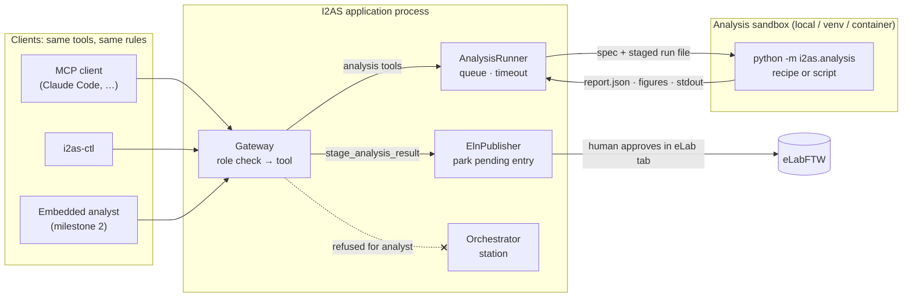

# An analysis agent for I2AS

Status: **milestone 1 implemented** (the analyst role, sandboxed scripts, the
tool surface and the magnetoresistance recipe). The embedded agent host and
the Analyst tab (milestones 2 and 3) are designed here and not built yet.

## The problem

Today a finished run is analysed by a fixed script: the recipe chosen for its
procedure runs, and its report is held as a pending notebook entry for a human
to approve. What we want is an agent that works like a physicist looking at
new data. It reads the run, tries a fit, plots it, looks at the residuals,
tries something else, decides what belongs in the eLab entry, and keeps the
analyses that proved useful as recipes for the next run.

Three requirements shaped the design:

1. **The agent must not be able to reach the station.** Analysis code is
   written by a model and runs on the measurement PC. It must not be able to
   send station commands, whether by being granted them or by going around
   the permission checks.
2. **The embedded agent and MCP clients must see exactly the same tools.**
   An in-app agent, Claude Code over MCP and the CLI must not have
   different capabilities, schemas or rules.
3. **The model provider is configurable.** The embedded agent talks to any
   OpenAI-compatible endpoint: OpenAI, Anthropic's compatible endpoint,
   vLLM, Ollama or LM Studio.

## Why a separate environment is necessary

The analysis worker already runs in its own process, and import contract C22
already stops it from importing the Station. That does not stop analysis code
from reaching the station, because this application accepts commands through
two channels that any process running as the same user can use:

- the **request spool**, a folder where a JSON file declaring a role is
  picked up and submitted by the engine's own tick
  (`core/request_spool.py`);
- the **gateway socket**, whose token is written to `gateway.json` next to
  the socket.

Credentials are a separate risk. The worker inherits this process's
environment, which may hold `I2AS_ELAB_APIKEY` and an LLM key.

So the answer is layered. Each layer is checked mechanically; none relies on
the model behaving well:

| Layer | What it stops | Where |
|---|---|---|
| **Role**: `analyst` | The agent *asking* the station to do anything. Refused in `authorize()` before the engine sees it. | `session/gateway/roles.py` |
| **Action class**: `analysis` | An analysis permission quietly including run control. `write_analysis_recipe` and `run_analysis` used to be `run_control`. | `session/gateway/action_classes.py` |
| **Worker process** (C22) | Analysis code *importing* the Station, the engine or the notebook. | `pyproject.toml` import contracts |
| **Sandbox**: `venv` | Analysis code seeing credentials, touching the recorded run file, or pulling this application's dependencies. | `session/analysis_sandbox.py` |
| **Sandbox**: container (planned) | Analysis code reaching the spool or the socket at all: no network, only the analysis folder mounted. | a further `AnalysisSandbox` backend |
| **Approval** | Anything reaching the notebook without a human. | `ExperimentManager.approve_eln_draft()` (unchanged) |

The `venv` backend does not change the operating-system user. That is stated
in the code and here: it separates dependencies, credentials and data, and the
container backend is the hard boundary.

## Architecture



The embedded agent is **a gateway client like any other**. It connects with
`Role.ANALYST`, receives the tool list from `render_tools()` (the same
declarations the MCP adapter publishes), and every call it makes is
authorized, recorded in the agent feed and answered exactly as an MCP
client's would be. Requirement 2 holds because there is only one tool
surface to use, not because two copies are kept in sync.

## The agent's loop: explore, decide, keep

| Step | Tool | Class | What happens |
|---|---|---|---|
| Look | `list_runs`, `read_run_columns`, `read_run_stats`, `read_run_slice`, `read_run_metadata` | read | Reads the run's columns and numbers. |
| Try a standard analysis | `list_analysis_recipes`, `run_analysis` (e.g. `recipe="magnetoresistance"`), `read_analysis_report` | analysis / read | Runs a shipped recipe. Its report becomes the run's pending entry. |
| Explore | `run_analysis_script`, `read_analysis_script_result` | analysis / read | Runs its own script in the worker and reads back the values, figure paths and printed output. **Parks nothing.** |
| Decide | `stage_analysis_result` | analysis | Parks one script's report as the run's pending entry. A human approves or discards it in the eLab tab. |
| Keep | `save_analysis_script_as_recipe` | analysis | Saves the script as a `ScriptRecipe` in the experiment's `analysis/recipes`, where it is discovered, reviewed and runnable by procedure. |

An analysis script is plain Python with `run`, `context`, `report`,
`manifest`, `options` and `np` bound (the script contract in
`i2as/analysis/scripts.py`). For example:

```python
b = run.read_slice("field_T")
v = run.read_slice("voltage_V")          # (n, n_loop1, n_loop2)
r = (v[:, 0, 0] - v[:, 1, 0]) / 2e-6     # current reversal, I = 1 µA
c2, c1, r0 = np.polyfit(b, r, 2)
report.value("R0", r0, "Ω")
report.value("MR coefficient", c2, "Ω/T²")
fig, ax = context.pyplot().subplots()
ax.plot(b, r, "."); ax.plot(b, np.polyval([c2, c1, r0], b))
report.figure("mr", fig, "R(B) and quadratic fit")
report.summary(f"R0 = {r0:.4g} Ω; MR coefficient {c2:.3g} Ω/T².")
print("residual rms", np.std(r - np.polyval([c2, c1, r0], b)))
```

## Roles

| Action class | observer | **analyst** | debug | session | operator (human) |
|---|---|---|---|---|---|
| read | permitted | permitted | permitted | permitted | permitted |
| recovery | refused | refused | unattended only | permitted | permitted |
| run_control | refused | refused | refused | permitted | permitted |
| envelope | refused | refused | refused | refused | permitted |
| **analysis** | refused | permitted | refused | permitted | permitted |

`analyst` and `debug` are side by side: neither is within the other. Every
"no more than this role" check (a deployment's ceiling, the request spool's
cap) compares the matrix cell by cell (`role_within_ceiling()`), so a
partial order causes no problem. `ROLE_LADDER` is now only the order the
role selector lists them in.

`analysis` is a **session-only** class (`SESSION_ONLY_ACTION_CLASSES`): no
`@control` may declare it, and `classify_control()` refuses one that claims
to. Otherwise an instrument action labelled `analysis` would be handed to a
role that was only meant to analyse.

To connect an MCP client with analysis rights only, set `I2AS_MCP_ROLE=analyst`
in `.mcp.json`. To make analysis the most any agent connection can be granted,
choose `analyst` in the Connections dialog's role ceiling.

## The sandbox

`analysis.sandbox` in the user settings file (`eln-settings.json` in the
user config directory, or the path in `I2AS_ELN_SETTINGS`):

```json
{
  "analysis": {
    "enabled": true,
    "recipes": {"Field Sweep": "magnetoresistance"},
    "sandbox": {
      "backend": "venv",
      "python": "C:/i2as-analysis/.venv/Scripts/python.exe",
      "stage_inputs": true,
      "env_passthrough": ["LAB_DATA_ROOT"]
    }
  }
}
```

| Backend | Interpreter | Environment | Run file | Working dir |
|---|---|---|---|---|
| `local` (default) | this one | inherited | the recorded file | inherited |
| `venv` | `sandbox.python` | allow-list, credentials dropped, `MPLBACKEND=Agg` | a copy in `<analysis>/input/` | the analysis folder |
| container (planned) | the image's | the image's | the analysis folder mounted, nothing else | the mount |

To set up the `venv` backend, create the environment and install the analysis
stage plus whatever the lab's analysis needs, such as scipy, scikit-image or
torch for image recognition. None of it goes into the application's own
environment:

```
python -m venv C:/i2as-analysis/.venv
C:/i2as-analysis/.venv/Scripts/pip install "i2as[analysis]" scipy scikit-image
```

A misconfigured sandbox, such as a missing interpreter or a file that cannot
be staged, produces a **failed** report naming the cause, and a fallback entry
is still left pending. It never fails silently.

## Milestone 2: the embedded analyst (designed, not built)

The home for it is `i2as/session/analyst/`, in the session layer next to the
gateway:

- `settings.py` holds `AnalystSettings` under `analyst` in the same settings
  file, with the same rules as `AssistantSettings`: `enabled`, `base_url`
  (OpenAI-compatible, e.g. `https://api.openai.com/v1`,
  `http://localhost:11434/v1`), `model`, `api_key` (redacted, env override
  `I2AS_ANALYST_APIKEY`), `max_turns`, `max_tokens`, `max_cost_usd`,
  `auto_procedures` (procedures analysed automatically on run finish), and
  `instructions` (a lab-specific paragraph appended to the system prompt).
- `client.py` is a `ChatClient` protocol with one method,
  `complete(messages, tools) -> ChatTurn`, and `OpenAICompatibleClient`,
  implemented over `urllib` with no required SDK and injectable so the tests
  use a fake. Tool schemas come from `ToolSpec.to_schema()`, wrapped in the
  `{"type": "function", "function": {...}}` shape. That shape is the only
  place the two tool formats differ.
- `loop.py` is the agent loop. It opens a `Gateway(engine, Role.ANALYST,
  "analyst-<model>")` over the existing `ToolContext`, sends the tool list,
  and executes each tool call through `gateway.call_tool()`, which applies the
  same checks as MCP. It stops at the end of the model's turn or at a budget
  limit. Polling for `read_analysis_script_result` answers `running` is done
  by the loop on a `QTimer`, never by sleeping on the GUI thread.
- There are **two triggers**. First, automatically: `ElnPublisher`'s
  `analysis_requested` for a procedure in `auto_procedures` starts a session
  whose instruction is "analyse run X and stage what belongs in the notebook".
  Second, on demand: the operator types an instruction in the Analyst tab.
- Every tool call is already recorded in the agent feed by the gateway. The
  loop also writes its transcript (the model's text between calls) to
  `<analysis>/<run>/analyst/<session>.jsonl`, so why it staged what it staged
  can be reviewed.

The agent never publishes. It stages, and the human approves in the eLab tab,
exactly as today.

## Milestone 3: where it is visible in the GUI (designed, not built)

- **The "Analyst" tab**, next to "Queue" and "eLab" in the procedure
  window's top-right quadrant (`procedure_window._build_queue_quadrant`). It
  has a run picker, an instruction box with Run and Stop, a live list of the
  session's tool calls and results read from the agent feed, figure
  thumbnails from `read_analysis_script_result`'s `figure_paths`, and a
  running count of turns and cost. A "Save as recipe" button calls
  `save_analysis_script_as_recipe` for the selected script.
- **The "eLab" tab** is unchanged in behaviour. Its pending entry already
  shows the recipe that produced it, and an entry staged from a script is
  labelled `script:<id>`.
- **Settings**: the notebook settings dialog gets an "Analysis agent" section
  (endpoint, model, key variable, budgets, automatic procedures) and a
  "Sandbox" section (backend, interpreter, staging).
- **Connections dialog**: `analyst` already appears in the role selector,
  because the selector is drawn from `ROLE_LADDER`.

## Milestone 4: the container sandbox and heavier models

A `ContainerSandbox(AnalysisSandbox)` runs the worker with Docker or Podman:
no network, the analysis folder as the only mount, and the lab's analysis
image (GPU-enabled when image-recognition models need it). It follows the same
`prepare()`/`launch()` interface, so the runner, the tools and the agent do
not change.

## What milestone 1 changed

- `ActionClass.ANALYSIS` and `Role.ANALYST`, with a permission-matrix row and
  column. `write_analysis_recipe` and `run_analysis` are reclassified from
  `run_control` to `analysis`. `session` keeps them, and `observer` and
  `debug` are still refused, so no existing role gained authority.
- Four tools: `run_analysis_script`, `read_analysis_script_result`,
  `stage_analysis_result` and `save_analysis_script_as_recipe`.
- The worker gains a script mode (`AnalysisSpec.script_path`,
  `analysis/scripts.py`, `ScriptRecipe`), and the runner gains
  `start_script()` / `script_finished`. Script results are never parked.
- `session/analysis_sandbox.py` with the `local` and `venv` backends, and
  `analysis.sandbox` in the settings.
- The `magnetoresistance` recipe fits R(B) = R0 + c1·B + c2·B² (or c2·|B|)
  and reports R0, the MR coefficient, the odd term and MR% at the largest
  field, with a fit-and-residuals figure. Current reversal is handled with a
  V–I slope per point. It runs when asked for by name: a field sweep's default
  stays `generic_sweep` until a settings line makes it the default.

## Open questions

- Should `stage_analysis_result` from an `analyst` in an **unattended**
  experiment still only park (as now), or may a lab choose auto-publish for
  agent-staged entries? The current answer is to park.
- Budget defaults for the automatic trigger: turns, tokens, and dollars per
  run.
- Whether the Analyst tab should also show figures inline in the chat, or
  only in the eLab preview.
