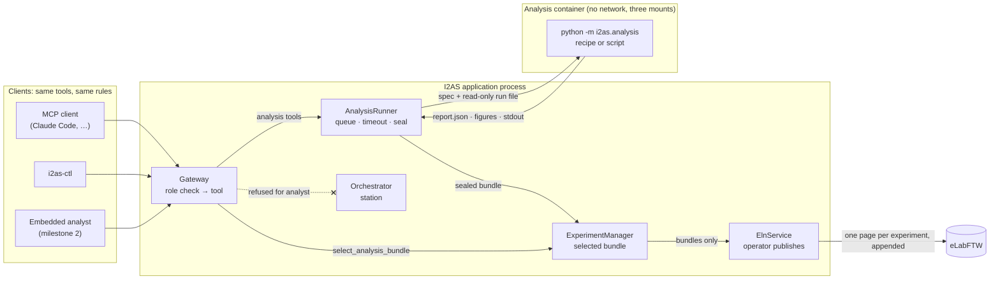

# An analysis agent for I2AS

Status: **milestone 1 implemented** (the analyst role, sandboxed scripts, the
tool surface and the magnetoresistance recipe), **the uniform session
layout implemented** (below), and **the container sandbox implemented**
(milestone 4's sandbox half: every analysis runs in Docker or Podman). The embedded agent host (milestone 2), the
Analysis screen (milestone 3) and analysis across a whole session are
planned here; none of them is built yet. The plan below was reviewed
against the code by an independent agent. Its corrections are folded in,
and "Findings from the review" lists them.

**Since 2026-09-27 analysis and the notebook are separate layers**
([eln-analysis-publishing.md](eln-analysis-publishing.md)): every analysis is
sealed into an **analysis bundle**, a run is represented by its **selected
bundle**, and nothing here parks or publishes a notebook entry. The agent's
work ends at the bundle; the operator links the experiment's page and
publishes. Where this plan still says "pending entry", "stage" or "eLab tab",
read "selected bundle", `select_analysis_bundle` and "Analysis tab".

## The session layout: one tree an agent can walk

Analysis across a session only works if every run of every experiment is
where the agent expects it. So the operator makes one choice about location,
the **session folder**, and everything below it is fixed:

```
<session folder>/                     chosen in User → Session Folder…
  session.json                        name, owner, experiment index
  key_results.jsonl                   (planned) session key results, app-written only
  analysis/series/<analysis_id>/      (planned) analyses over many runs
  NNN_<label>/                        one experiment; NNN = order started
    experiment.json  agent_actions.jsonl  outbox.jsonl
    analysis_journal.jsonl            (planned) every analysis step, app-written only
    data/run-NNNN_<Procedure>[_<label>].h5
    analysis/recipes/
    analysis/run-NNNN/                report.json, figures, *.plot.json, scripts/<id>/
```

- **Sessions** are registered in `<measurement root>/sessions.json` (active
  and recent). `SessionStore` creates a session in a new or empty folder,
  and `session_id` is always the folder's own name.
- **Experiments** are `NNN_<label>`: the next serial number, then the
  operator's folder label or the slugged title (`ExperimentStore.make_experiment_id`).
- **Runs** are placed by the engine, whoever started them. The session layer
  installs the open experiment's `data/` folder (`Orchestrator.set_run_folder`),
  and every run becomes `run-NNNN` with the file
  `run-NNNN_<Procedure>[_<label>].h5` (`core/run_naming.py`). With no
  experiment open, every run is refused (`rule: no_experiment`). Numbers are
  never reused.
- **App-owned records sit outside `analysis/`:** the journal and key
  results. A sandboxed script's working directory is its own folder under
  `analysis/`, mounted into its container, so nothing a script can reach by
  a relative path is ever treated as a trusted record.

## The problem

Today a finished run is analysed by a fixed script: the recipe chosen for its
procedure runs, and its report is held as a pending notebook entry for a human
to approve. What we want is an agent that works like a physicist looking at
new data. It reads the run, tries a fit, plots it, looks at the residuals,
tries something else, decides what belongs in the eLab entry, and keeps the
analyses that proved useful as recipes for the next run.

Three requirements shaped the design:

1. **The agent must not be able to reach the station.** Analysis code is
   written by a model and runs on the measurement PC. It must not be able to
   send station commands, whether by being granted them or by going around
   the permission checks.
2. **The embedded agent and MCP clients must see exactly the same tools.**
   An in-app agent, Claude Code over MCP and the CLI must not have
   different capabilities, schemas or rules.
3. **The model provider is configurable.** The embedded agent talks to any
   OpenAI-compatible endpoint: OpenAI, Anthropic's compatible endpoint,
   vLLM, Ollama or LM Studio.

## Why a separate environment is necessary

The analysis worker already runs in its own process, and import contract C22
already stops it from importing the Station. That does not stop analysis code
from reaching the station, because this application accepts commands through
two channels that any process running as the same user can use:

- the **request spool**, a folder where a JSON file declaring a role is
  picked up and submitted by the engine's own tick
  (`core/request_spool.py`);
- the **gateway socket**, whose token is written to `gateway.json` next to
  the socket.

Credentials are a separate risk. The worker inherits this process's
environment, which may hold `I2AS_ELAB_APIKEY` and an LLM key.

So the answer is layered. Each layer is checked mechanically; none relies on
the model behaving well:

| Layer | What it stops | Where |
|---|---|---|
| **Role**: `analyst` | The agent *asking* the station to do anything. Refused in `authorize()` before the engine sees it. | `session/gateway/roles.py` |
| **Action class**: `analysis` | An analysis permission quietly including run control. `write_analysis_recipe` and `run_analysis` used to be `run_control`. | `session/gateway/action_classes.py` |
| **Worker process** (C22, C26) | Analysis code *importing* the Station, the engine or the notebook. | `pyproject.toml` import contracts |
| **Sandbox**: container | Analysis code reaching the spool, the socket, the settings files or the network at all, seeing credentials, or writing the recorded run file. | `session/analysis_sandbox.py` |
| **No notebook tool** | An agent reaching the notebook at all. The `eln` action class is refused to every agent role; publishing is the operator's, approved once per experiment. | `session/gateway/roles.py`, `ExperimentManager.approve_eln_publishing()` |

The container is the hard boundary: the spool, the gateway descriptor and the
settings files are not in its filesystem, and it has no network to reach the
socket over.

## Architecture


```mermaid
flowchart LR
    subgraph clients["Clients: same tools, same rules"]
        MCP["MCP client<br/>(Claude Code, …)"]
        CLI["i2as-ctl"]
        EMB["Embedded analyst<br/>(milestone 2)"]
    end
    subgraph app["I2AS application process"]
        GW["Gateway<br/>role check → tool"]
        RUN["AnalysisRunner<br/>queue · timeout · seal"]
        MGR["ExperimentManager<br/>selected bundle"]
        PUB["ElnService<br/>operator publishes"]
        ENG["Orchestrator<br/>station"]
    end
    subgraph sandbox["Analysis container (no network, three mounts)"]
        W["python -m i2as.analysis<br/>recipe or script"]
    end
    MCP --> GW
    CLI --> GW
    EMB --> GW
    GW -- "analysis tools" --> RUN
    GW -. "refused for analyst" .-x ENG
    RUN -- "spec + read-only run file" --> W
    W -- "report.json · figures · stdout" --> RUN
    RUN -- "sealed bundle" --> MGR
    GW -- "select_analysis_bundle" --> MGR
    MGR -- "bundles only" --> PUB
    PUB -- "one page per experiment, appended" --> ELN[(eLabFTW)]
```

The embedded agent is **a gateway client like any other**. It connects with
`Role.ANALYST`, receives the tool list from `render_tools()` (the same
declarations the MCP adapter publishes), and every call it makes is
authorized, recorded in the agent feed and answered exactly as an MCP
client's would be. Requirement 2 holds because there is only one tool
surface to use, not because two copies are kept in sync.

## The agent's loop: explore, decide, keep

| Step | Tool | Class | What happens |
|---|---|---|---|
| Look | `list_runs`, `read_run_columns`, `read_run_stats`, `read_run_slice`, `read_run_metadata` | read | Reads the run's columns and numbers. |
| Try a standard analysis | `list_analysis_recipes`, `run_analysis` (e.g. `recipe="magnetoresistance"`), `read_analysis_bundle` | analysis / read | Runs a shipped recipe. Its completed bundle becomes the run's selected bundle. |
| Explore | `run_analysis_script`, `read_analysis_script_result` | analysis / read | Runs its own script in the worker and reads back the values, figure paths and printed output. **Selects nothing.** |
| Summarise | `draft_analysis_summary` | analysis | Asks the drafting model for a summary of the run's facts, kept as a `draft` bundle. |
| Decide | `list_analysis_bundles`, `select_analysis_bundle` | read / analysis | Chooses the bundle (a recipe's, a script's, a draft's) that represents the run. |
| Keep | `save_analysis_script_as_recipe` | analysis | Saves the script as a `ScriptRecipe` in the experiment's `analysis/recipes`, where it is discovered, reviewed and runnable by procedure. |

An analysis script is plain Python with `run`, `context`, `report`,
`manifest`, `options` and `np` bound (the script contract in
`i2as/analysis/scripts.py`). For example:

```python
b = run.read_slice("field_T")
v = run.read_slice("voltage_V")          # (n, n_loop1, n_loop2)
r = (v[:, 0, 0] - v[:, 1, 0]) / 2e-6     # current reversal, I = 1 µA
c2, c1, r0 = np.polyfit(b, r, 2)
report.value("R0", r0, "Ω")
report.value("MR coefficient", c2, "Ω/T²")
fig, ax = context.pyplot().subplots()
ax.plot(b, r, "."); ax.plot(b, np.polyval([c2, c1, r0], b))
report.figure("mr", fig, "R(B) and quadratic fit")
report.summary(f"R0 = {r0:.4g} Ω; MR coefficient {c2:.3g} Ω/T².")
print("residual rms", np.std(r - np.polyval([c2, c1, r0], b)))
```

## Roles

| Action class | observer | **analyst** | debug | session | operator (human) |
|---|---|---|---|---|---|
| read | permitted | permitted | permitted | permitted | permitted |
| recovery | refused | refused | unattended only | permitted | permitted |
| run_control | refused | refused | refused | permitted | permitted |
| envelope | refused | refused | refused | refused | permitted |
| **analysis** | refused | permitted | refused | permitted | permitted |

`analyst` and `debug` are side by side: neither is within the other. Every
"no more than this role" check (a deployment's ceiling, the request spool's
cap) compares the matrix cell by cell (`role_within_ceiling()`), so a
partial order causes no problem. `ROLE_LADDER` is now only the order the
role selector lists them in.

`analysis` is a **session-only** class (`SESSION_ONLY_ACTION_CLASSES`): no
`@control` may declare it, and `classify_control()` refuses one that claims
to. Otherwise an instrument action labelled `analysis` would be handed to a
role that was only meant to analyse.

To connect an MCP client with analysis rights only, set `I2AS_MCP_ROLE=analyst`
in `.mcp.json`. To make analysis the most any agent connection can be granted,
choose `analyst` as the role ceiling in Settings → Connections.

## The sandbox

Every recipe and every analysis script runs in a container. A container
engine (Docker Desktop on Windows and macOS; Docker or Podman on Linux) is a
dependency of **analysis**, not of I2AS: a setup that never analyses installs
nothing, and switching analysis on (Settings → Analysis, or the Analysis
tab's "Analyse finished runs") is refused, with the reason, until the engine is running and
the image is built.

`ContainerSandbox` starts each worker as:

```
docker run --rm --name i2as-analysis-<id> --pull never --network none   --read-only --tmpfs /tmp --cap-drop ALL --security-opt no-new-privileges   --memory 4g --cpus 2 --pids-limit 256   --mount type=bind,source=<analysis folder>,target=/work   --mount type=bind,source=<run file>,target=/input/<name>,readonly   --mount type=bind,source=<experiment recipes>,target=/recipes/0,readonly   i2as-analysis:latest python -m i2as.analysis run --spec /work/spec.json
```

- **No network**, so the gateway socket, the HTTP endpoint and any registry
  are unreachable.
- **Three mounts, nothing else.** The spec the worker reads names container
  paths; the runner still reads `report.json` from the host folder.
- **No environment from the application**: an ELN or LLM key in this
  process's environment never reaches analysis code.
- **Never pulled**: a missing image is a failed analysis naming it.
- On a timeout or a cancel the runner kills the engine's client and runs
  `docker kill i2as-analysis-<id>`, because killing the client alone can leave
  the container running.

**The image** is built locally from `i2as/analysis/container/Dockerfile`
(Python 3.12 slim, numpy, h5py, matplotlib, scipy) over a build context
holding only `i2as/analysis` and the three core modules C22 allows
(`data_reader`, `events`, `exceptions`). The Station is not in the image at
all. Build it from Settings → Analysis → **Build image**, or:

```
python -m i2as.session.analysis_sandbox check
python -m i2as.session.analysis_sandbox build-image
```

A lab that needs more libraries (scikit-image, torch for image recognition)
builds its own image `FROM i2as-analysis:latest` and names it in Settings →
Analysis → Image.

**Settings** live in the `analysis` section of the general settings file
(`settings.json` in the user config directory, or the path in
`I2AS_SETTINGS`), edited from Settings → Analysis:

```json
{
  "analysis": {
    "enabled": true,
    "timeout_s": 120,
    "recipes": {"Field Sweep": "magnetoresistance"},
    "sandbox": {
      "engine": "docker",
      "image": "i2as-analysis:latest",
      "memory": "4g",
      "cpus": 2,
      "pids_limit": 256
    }
  }
}
```

A sandbox that cannot run the worker (no engine, the engine not running, no
image, an unmountable path) produces a **failed** report naming the cause,
and a fallback entry is still left pending. It never fails silently.

## Milestone 2: the embedded analyst (designed, not built)

The home for it is `i2as/session/analyst/`, in the session layer next to the
gateway:

- `settings.py` holds `AnalystSettings` under `analyst` in the same settings
  file, with the same rules as `AssistantSettings`: `enabled`, `base_url`
  (OpenAI-compatible, e.g. `https://api.openai.com/v1`,
  `http://localhost:11434/v1`), `model`, `api_key` (redacted, env override
  `I2AS_ANALYST_APIKEY`), `max_turns`, `max_tokens`, `max_cost_usd`,
  `auto_procedures` (procedures analysed automatically on run finish), and
  `instructions` (a lab-specific paragraph appended to the system prompt).
- `client.py` is a `ChatClient` protocol with one method,
  `complete(messages, tools) -> ChatTurn`, and `OpenAICompatibleClient`,
  implemented over `urllib` with no required SDK and injectable so the tests
  use a fake. Tool schemas come from `ToolSpec.to_schema()`, wrapped in the
  `{"type": "function", "function": {...}}` shape. That shape is the only
  place the two tool formats differ.
- `loop.py` is the agent loop. It opens a `Gateway(engine, Role.ANALYST,
  "analyst-<model>")` over the existing `ToolContext`, sends the tool list,
  and executes each tool call through `gateway.call_tool()`, which applies the
  same checks as MCP. It stops at the end of the model's turn or at a budget
  limit. Polling for `read_analysis_script_result` answers `running` is done
  by the loop on a `QTimer`, never by sleeping on the GUI thread.
- There are **two triggers**. First, automatically: the `AnalysisTrigger`
  (`session/analysis_trigger.py`), for a procedure in `auto_procedures`,
  starts a session whose instruction is "analyse run X and choose the bundle
  that represents it".
  Second, on demand: the operator types an instruction in the Analysis
  screen's "Ask the analyst…" box.
- Every tool call is already recorded in the agent feed by the gateway. The
  loop also writes its transcript (the model's text between calls) to
  `<analysis>/<run>/analyst/<session>.jsonl`, so why it staged what it staged
  can be reviewed.

The agent never publishes. It chooses a run's bundle; the operator publishes
from the Analysis tab.

## Milestone 3: the Analysis screen (planned)

### What is visible today, and why it is not enough

| Where | Shows | Misses |
|---|---|---|
| eLab tab (Procedure window, top-right, beside Queue) | Recipe choice, "Run analysis", preview of the one pending entry, Publish/Discard | Every script an agent ran; anything earlier than the latest report |
| Agents panel (Monitor window) | Agent commands and verdicts, from the engine's event stream | Analysis tool calls: they are written to `agent_actions.jsonl` and the panel reads that file only when it opens, so they never appear live |
| `analysis/<run>/scripts/<id>/` on disk | Each script, its report, figures and printed output | Nothing in the GUI reads it |

So an operator cannot currently watch what an agent is analysing, or look
back afterwards at what it tried. The Analysis screen fixes that. Because
the GUI never keeps its own copy of the truth, the data layer comes first.

### Layer 1: a record of every analysis step (no GUI)

1. **The analysis journal** (`session/analysis_journal.py`) is one
   append-only `<experiment>/analysis_journal.jsonl` **per experiment**,
   outside `analysis/`. Each step carries `run_ids` (one run, or many for a
   series). It follows the same record rules as the agent feed (`schema`,
   `ts`, `seq`, every key always present). It is written only in the
   application process, on the GUI thread, through one instance per
   experiment (like `ExperimentFeeds`). A journal-writing tool called from
   `i2as-ctl`'s own process is refused rather than appending from a second
   process. On load, a `script_started` with no finish is closed as
   `abandoned`. It is separate from the agent feed because the feed records
   agents only, and the journal must also show the operator's steps. One
   line per step:

   | `step` | Written by | Points at |
   |---|---|---|
   | `recipe_started` / `recipe_finished` | `AnalysisRunner` | `report.json`, recipe name and digest |
   | `script_started` / `script_finished` | `run_analysis_script`, `AnalysisRunner` | `scripts/<id>/`: code, report, stdout |
   | `note` | `annotate_analysis` | the text, optionally a `script_id` |
   | `staged` | `stage_analysis_result` | the `script_id` whose report was parked |
   | `saved_as_recipe` | `save_analysis_script_as_recipe` | the recipe name and digest |
   | `approved` / `discarded` | `ExperimentManager` | the pending entry's source |

   Every step names its `actor` (kind, id, role). It is written by the code
   that performs the step, never by the agent, so an agent cannot skip it.
   Keeping it outside any folder a script works in is what stops a script
   overwriting it (see "Findings"). A conformance test asserts that every
   `analysis`-class tool writes a step.
2. **Live listeners.** The journal calls back its listeners
   (`add_listener(callback)`) after each append. Stdio MCP and HTTP MCP
   calls reach the in-app `GatewayServer` over its socket, and the tool code
   runs on the GUI thread, so an MCP agent's steps reach the screen live.
   `i2as-ctl` builds its own gateway in its own process and does not. A thin Qt adapter (`AnalysisActivity(QObject)`, signal
   `step_recorded(run_id, dict)`) is owned by the app next to
   `ExperimentFeeds`.
3. **`annotate_analysis(run_id, text, script_id?)`** is a new
   `analysis`-class tool (recorded) that lets the agent explain why, e.g.
   "residuals are asymmetric, so I'm symmetrising for Hall pickup". The
   embedded analyst's commentary (milestone 2) goes to the same step kind.
5. **Operator steps have an explicit actor.** The screen's Stage and Save
   as recipe call one shared implementation of each step, which takes the
   acting `Actor` explicitly (the operator's here, the connection's in the
   gateway). `call_session_tool()` skips authorization and records nothing,
   so it is not a door for the operator.
4. **Plot data, not only pictures.** `ScriptReport.plot(name, series,
   x_label, y_label, caption)` and `AnalysisContext.plot(...)` write
   `<name>.plot.json` (a list of series: `x`, `y`, optional `yerr`, `label`,
   `style` of `points` / `line` / `band`, and `role` of `data` / `fit` /
   `residual`) and render the PNG from the same data. `FigureRef` gains an
   optional `data_file`. The schema and its parser live in
   `i2as.analysis.report`, and the application reads a plot file only
   through `report.output_file()`: a plain `*.plot.json` inside the step's
   folder, at most 5 MB and 200k finite points. The eLab entry still gets the PNG; the screen draws
   the data in pyqtgraph. A figure made only with matplotlib has no
   `data_file` and is shown as an image. `magnetoresistance` switches to
   `plot()`.

### Layer 2: the screen

**The switch.** Only the Procedure window's quadrant grid (`_main_splitter`)
goes into a `QStackedWidget`, with two pages: **Setup** (today's 2×2 grid,
unchanged) and **Analysis**. The banner, the progress bar and Pause and Abort
stay visible on both pages. A `Setup | Analysis` tab bar above the stack
(the same pattern as the Monitor window's `Monitor | Logs` switcher)
switches between them. Ctrl+1 and Ctrl+2 are window-scoped shortcuts, and
the last page is remembered.
**It never switches on its own.** New steps from an agent add to a count
badge on "Analysis", cleared when the page is shown. A finished run's first
recipe or agent step raises a banner: "run-0012 analysed — View".

**Layout** (`gui/analysis_workspace/`, one widget per region, each
talking only to the journal and the manager):

```
┌ Setup | Analysis (3) ────────────────────────────────────────────────┐
│ RUNS              │ STEPS  run-0012                 │ DETAIL           │
│ ● run-0012 ✎ 3    │ 14:02 agent  recipe magnetoresistance ✓ │ interactive plot │
│   run-0011 ✓      │ 14:03 agent  note "residuals asymmetric"│ values table     │
│   run-0010        │ 14:03 agent  script mr_sym ✓ ▣▣         │ code · output    │
│ raw: x ▾  y ▾     │ 14:04 agent  staged mr_sym              │                  │
├───────────────────┴─────────────────────────────────┴──────────────────┤
│ eLab entry (pending): preview · Publish · Discard · Stage · Save recipe  │
└─────────────────────────────────────────────────────────────────────────┘
```

| Widget | Shows | Reads from |
|---|---|---|
| `RunBrowser` | The open experiment's runs, badged with pending entry, published, and step count; a raw-data quick plot (x and y columns) for the selected run | `ExperimentManager`, `RunSource` |
| `StepTimeline` | One row per journal step: time, actor (agent id or "you"), kind, status, figure thumbnails | `AnalysisJournal` |
| `StepDetail` | The selected step: plot (pyqtgraph from `.plot.json`, else the PNG), results table, script code, printed output, warnings or error | The step's folder |
| `EntryStrip` | The pending entry preview and approval, taken out of `AnalysisPanel` so the eLab tab and this screen share one implementation | `ExperimentManager`, `ElnPublisher` |

**What the operator can do here.** View everything; **Publish / Discard**
the pending entry; **Stage** the selected script result; **Save as recipe**
from the selected script. Stage and Save call the same tool functions the
agent calls (`call_session_tool` with an operator `ToolContext`), so the
journal tells one story whoever acted. Editing code and running recipes
from this screen are out of scope for now; the eLab tab keeps its
"Run analysis".

**Placeholder for milestone 2.** A collapsed "Ask the analyst…" box under
the timeline. The embedded analyst writes to the same journal, so it needs
no screen of its own.

### Analysis across a session (planned)

The goal is to analyse many runs, across the experiments of one session,
together (e.g. R0 or MR against temperature over a series of field sweeps),
keep the key numbers, and look them up later when planning the next
experiment.

- **A multi-run analysis.** `AnalysisSpec.runs` becomes a list of
  `(experiment_id, run_id, data_path, manifest)`; `run_id` stays for a single
  run. The application resolves every input from validated ids through
  `ExperimentStore.resolve_data_file`, inside the session folder, and
  stages them as `input/<experiment>/<run>.h5` with caps on count and bytes,
  using hard links rather than copies where it can. A `SeriesRecipe` gets
  `analyse(runs, context)`, and a script gets `runs` beside `run`. The runner
  is keyed by an `analysis_id` and writes to
  `<session>/analysis/series/<analysis_id>/`, with a lower priority than the
  automatic per-run analyses.
- **Finding runs.** `list_session_runs(filter)` walks the session tree and
  returns each run's experiment, procedure, time and setpoints (T, B from the
  manifest). `define_run_set(name, members)` saves a named selection.
- **Key results.** `<session>/key_results.jsonl` is append-only, and only
  the application writes it. Each line holds `seq`, `ts`, `result_id`,
  `quantity` (a key from a declared vocabulary, `QuantitySpec`, declared once
  like `ParamSpec`), `value`, `unit`, `uncertainty`, `conditions` (T, B, …
  each with `setpoint` or `measured` as its source), `provenance` (the runs,
  `analysis_id`, recipe, and a digest computed by the application rather
  than taken from the worker), `actor`, `note`, and `supersedes` (a
  correction is a new line; no line is ever edited).
  `record_key_result` only promotes a value from an existing ok report, so
  the number and its provenance come from the application's copy, not from
  the agent's arguments. `query_key_results(quantity, condition ranges,
  runs, since)` and `read_key_result_trend` are `read`. All of them are the
  same `ToolSpec`s for MCP and the embedded analyst.
- **On the Analysis screen:** a scope selector, This run / Series / Session.
  Session scope shows the key-results table and a pyqtgraph trend (quantity
  against a chosen condition, with error bars), where a click opens the
  source step.
- **Hard questions still open:**
  - the vocabulary of quantities (so "R0" means one thing across recipes);
  - unit normalisation;
  - setpoint vs measured conditions;
  - marking a key result stale when its recipe's digest changes, rather
    than rewriting it.

### Findings from the review (incorporated above)

- **Fixed (commit "Hand agents the analysis collaborators…"):**
  - The gateway was built without the analysis runner and the publisher, so
    every analysis tool over MCP was refused.
  - An `experiment_id` was used as a path unchecked.
  - Figure names from a script were followed as paths when publishing.
- **Corrected in this plan:**
  - "`ctl` is live": it is not.
  - "The journal cannot be forged": only if it sits outside any folder a
    script can reach.
  - The operator's `call_session_tool` "door": it does not exist, so steps
    take an explicit actor.
  - The stack: the whole central widget would have hidden Pause and Abort.
- **Still to do in milestone 3:** a size cap and name check on `*.plot.json`;
  hashing script digests in the application.

### Order of work

1. **Data layer:** the per-experiment `AnalysisJournal` and its listeners,
   `annotate_analysis`, `plot()` with validation, `FigureRef.data_file`,
   journal writes in the tools, the runner and the manager (with explicit
   actors), and digests computed by the application. Tested without a GUI.
2. **Multi-run analysis:** `AnalysisSpec.runs`, staging, `SeriesRecipe`,
   `runs` in scripts, the runner keyed by `analysis_id`, and
   `list_session_runs` / `define_run_set`.
3. **Key results:** the store, `QuantitySpec`, and `record_key_result` /
   `query_key_results` / `read_key_result_trend`.
4. **Read-only Analysis screen:** the switch, badge and banner, the three
   scopes, `RunBrowser`, `StepTimeline`, `StepDetail`, and `EntryStrip`
   shared with the eLab tab.
5. **Operator actions:** Stage and Save as recipe, and approve and discard
   recorded on the timeline.
6. **Milestone 2** plugs its console into the placeholder.

## Milestone 4: heavier models

The container sandbox itself is built (see "The sandbox"). What remains is
GPU access for image-recognition models: a `gpus` setting passed through as
`--gpus all`, and a CUDA base image a lab builds its own image from.

## What milestone 1 changed

- `ActionClass.ANALYSIS` and `Role.ANALYST`, with a permission-matrix row and
  column. `write_analysis_recipe` and `run_analysis` are reclassified from
  `run_control` to `analysis`. `session` keeps them, and `observer` and
  `debug` are still refused, so no existing role gained authority.
- Four tools: `run_analysis_script`, `read_analysis_script_result`,
  `stage_analysis_result` and `save_analysis_script_as_recipe`.
- The worker gains a script mode (`AnalysisSpec.script_path`,
  `analysis/scripts.py`, `ScriptRecipe`), and the runner gains
  `start_script()` / `script_finished`. Script results are never parked.
- `session/analysis_sandbox.py` and `analysis.sandbox` in the settings
  (first with `local`/`venv` backends; since replaced by the container
  backend).
- The `magnetoresistance` recipe fits R(B) = R0 + c1·B + c2·B² (or c2·|B|)
  and reports R0, the MR coefficient, the odd term and MR% at the largest
  field, with a fit-and-residuals figure. Current reversal is handled with a
  V–I slope per point. It runs when asked for by name: a field sweep's default
  stays `generic_sweep` until a settings line makes it the default.

## Open questions

- Should `stage_analysis_result` from an `analyst` in an **unattended**
  experiment still only park (as now), or may a lab choose auto-publish for
  agent-staged entries? The current answer is to park.
- Budget defaults for the automatic trigger: turns, tokens, and dollars per
  run.
- Whether the analyst console should also show figures inline, or only in
  the step detail.
